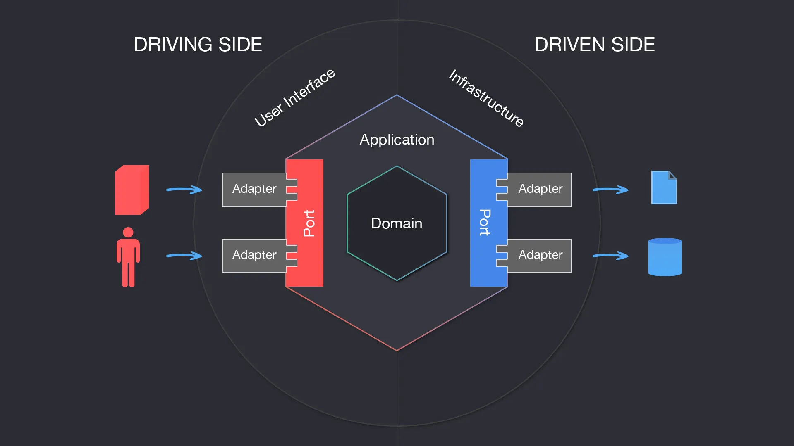
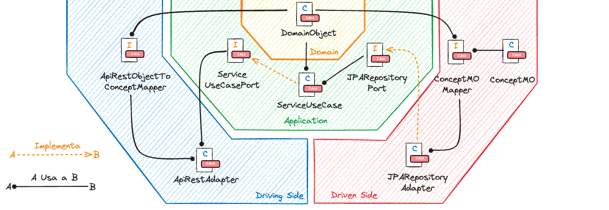
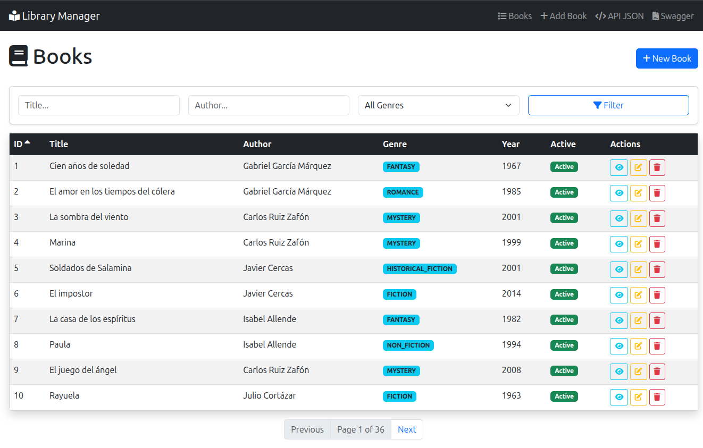
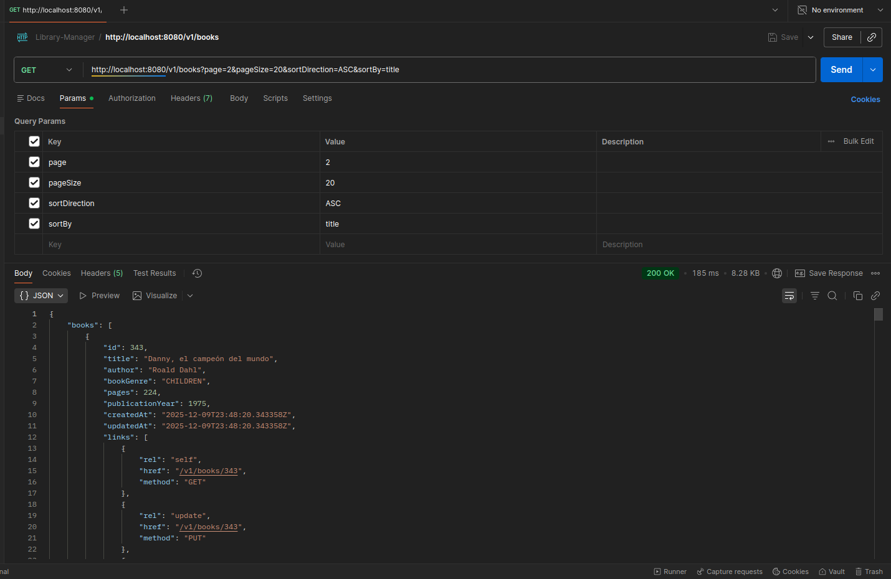
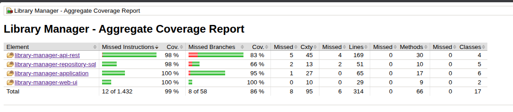

# Library Manager - Library Management System

[](https://www.oracle.com/java/)
[](https://spring.io/projects/spring-boot)
[](https://maven.apache.org/)
[](http://www.h2database.com/)

## 📋 Description

Library Manager is a web application developed with Spring Boot that implements **Hexagonal Architecture** (Ports & Adapters) for comprehensive library management. The system allows performing CRUD operations on books, with support for pagination, advanced filters, and a user-friendly web interface built with Thymeleaf.

### ✨ Key Features

- 🏗️ **Hexagonal Architecture** (Ports & Adapters) with clear separation of concerns
- 🧹 **Clean Code** following SOLID and DDD principles
- 🗃️ **H2 Database** in-memory with file persistence
- 📊 **REST API** with OpenAPI/Swagger 3.0 documentation
- 🌐 **Modern Web Interface** with Thymeleaf and Bootstrap 5
- 🧪 **High Test Coverage** with JaCoCo (91%+)
- 🔍 **Advanced Filters** by title, author, genre, and status
- 📄 **Pagination and Sorting** in lists
- ⚡ **Robust Validation** with Bean Validation
- 🎨 **Responsive Design** adapted for mobile and tablets

### 🎯 Core Functionality

The system allows managing books with the following capabilities:
- **Full CRUD**: Create, read, update, and delete books
- **Soft Delete**: Books are deactivated instead of physically deleted
- **Smart Filters**: Search by title, author, genre, and active/inactive status
- **Pagination**: Lists with page size control and navigation
- **Sorting**: By any field in ascending or descending order
- **Validation**: Data validated with business constraints

## 🚀 Quick Start

### Prerequisites

Ensure you have installed:

- ☕ **Java 21** or higher
- 📦 **Maven 3.8+**
- 🐙 **Git**

### Installation

1. **Download the project:**

Extract the project ZIP file into your working directory:

```bash
# 1. Extract the ZIP file
unzip library-manager-web.zip
cd library-manager-web

# 2. Generate OpenAPI resources
mvn generate-sources

# 3. Compile the project
mvn clean install

# 4. Run the application
java -jar boot/target/library-manager-boot-1.0.0.jar
```

**Alternative quick access:**
```bash
# Run directly with Maven
mvn spring-boot:run -pl boot
```

The application will be available at: **`http://localhost:8080`**

### Configuration

#### Environment Variables (Optional)

```bash
# Server port (default: 8080)
SERVER_PORT=8080

# Logging configuration
LOGGING_LEVEL_ROOT=INFO
LOGGING_LEVEL_ORG_SPRINGFRAMEWORK_WEB=DEBUG
```

#### H2 Database

The project uses H2 Database in-memory with file persistence. The H2 console is available at:
- **URL:** `http://localhost:8080/h2-console`
- **JDBC URL:** `jdbc:h2:~/librarydb;DB_CLOSE_ON_EXIT=FALSE`
- **User:** `sa`
- **Password:** *(empty)*

## 🏛️ Architecture

### Hexagonal Architecture Description

The application implements a hexagonal architecture (Ports & Adapters) where the domain is the core and is not coupled to external elements, following **Domain Driven Design (DDD)** principles.



### Project Structure

```
library-manager-web/
├── 📁 application/                                    # 🧠 Business logic and ports
│   ├── 📁 domain/                                    # Domain entities
│   │   ├── 📄 Book.java                             # Main Book entity
│   │   ├── 📄 BookGenre.java                        # Enum for literary genres
│   │   └── 📁 valueobjects/                         # Value Objects
│   │       ├── 📄 BookFilter.java                   # Filtering criteria
│   │       ├── 📄 PaginatedResult.java              # Paginated result
│   │       └── 📄 PaginationQuery.java              # Pagination query
│   ├── 📁 ports/                                    # Interfaces (driving/driven)
│   │   ├── 📁 driving/                              # Input ports
│   │   │   └── 📄 BookServicePort.java              # Book service port
│   │   └── 📁 driven/                               # Output ports
│   │       └── 📄 BookRepositoryPort.java           # Book repository port
│   └── 📁 services/                                 # Use cases
│       └── 📄 BookServiceUseCase.java               # Use case implementation
├── 📁 driving/                                        # 🔵 Input adapters
│   ├── 📁 api-rest/                                 # REST API Adapter
│   │   ├── 📁 contracts/                            # OpenAPI Contracts
│   │   │   └── 📄 openapi.yaml                      # OpenAPI 3.0 Specification
│   │   ├── 📁 controllers/                          # REST Controllers
│   │   │   └── 📄 BookRestController.java           # REST API Controller
│   │   ├── 📁 dtos/                                 # Generated DTOs
│   │   ├── 📁 mappers/                              # DTO-Domain Mappers
│   │   │   └── 📄 BookDtoMapper.java                # Mapper with MapStruct
│   │   └── 📁 handlers/                             # Error handling
│   │       └── 📄 GlobalExceptionHandler.java       # Global exception handler
│   └── 📁 web/                                      # Web UI Adapter
│       ├── 📁 controllers/                          # Web Controllers
│       │   └── 📄 BookWebController.java            # Web interface controller
│       └── 📁 templates/                            # Thymeleaf Views
│           ├── 📁 layout/                           # Base layouts
│           │   └── 📄 base.html                     # Main layout
│           └── 📁 books/                            # Book views
│               ├── 📄 list.html                     # Book list
│               ├── 📄 form.html                     # Create/Edit form
│               └── 📄 detail.html                   # Book detail
├── 📁 driven/                                         # 🔴 Output adapters
│   └── 📁 repository-sql/                           # Persistence adapter
│       ├── 📁 repositories/                         # JPA Repositories
│       │   └── 📄 BookJpaRepository.java            # Spring Data Repository
│       ├── 📁 entities/                             # JPA Entities
│       │   └── 📄 BookEntity.java                   # Book JPA Entity
│       ├── 📁 mappers/                              # Entity-Domain Mappers
│       │   └── 📄 BookEntityMapper.java             # Mapper with MapStruct
│       └── 📁 config/                               # JPA Configuration
│           └── 📄 RepositoryConfig.java             # Repositories config
├── 📁 boot/                                           # 🚀 Configuration and bootstrap
│   ├── 📁 src/main/java/                            # Main class
│   │   └── 📄 Application.java                      # Spring Boot Main
│   └── 📁 src/main/resources/                       # Resources
│       ├── 📄 application.yaml                      # Application configuration
│       └── 📄 init.sql                              # H2 initial data
├── 📁 images/                                         # 📸 Documentation images
│   ├── 📄 hexagonal-driving-driven.png              # Architecture diagram
│   ├── 📄 hexagonal-driving-driven2.png             # Detailed architecture diagram
│   ├── 📄 postman_v1.png                            # Postman tests screenshot
│   ├── 📄 web.png                                   # Web interface screenshot
│   └── 📄 coverage.png                              # Coverage report
├── 📄 .gitignore                                      # Git ignored files
├── 📄 README.md                                       # Main documentation
└── 📄 pom.xml                                         # Main Maven configuration
```

### Main Components



- **🧠 Application**: Defines driving/driven ports and contains pure business logic (framework independent).
- **🔵 Driving Side**: Adapters that allow the outside world to interact with the domain (REST API, Web UI).
- **🔴 Driven Side**: Adapters that allow the domain to interact with external systems (Database, external services).
- **🚀 Boot**: Assembles all modules into an executable JAR with Spring Boot configuration.

## 📱 Access

### REST API

- **Main endpoint:** `http://localhost:8080/v1/books`
- **Swagger Documentation:** `http://localhost:8080/swagger-ui.html`
- **OpenAPI Spec:** [openapi.yaml](driving/api-rest/contracts/openapi.yaml)

### Web Interface

- **URL:** `http://localhost:8080/ui/books`
- **Features:**
    - ✅ Book list with pagination
    - ✅ Filters by title, author, genre, and status
    - ✅ Create new book
    - ✅ Edit existing book
    - ✅ View book details
    - ✅ Activate/Deactivate book (soft delete)



## 📚 API Documentation

### Interactive Documentation

- **Swagger UI:** `http://localhost:8080/swagger-ui.html` *(Once the application is started)*

[](https://editor.swagger.io/?url=https://raw.githubusercontent.com/NAO0325/library-manager-web/main/driving/api-rest/contracts/openapi.yaml)
[View Swagger Editor Online](https://editor.swagger.io/?url=https://raw.githubusercontent.com/NAO0325/library-manager-web/main/driving/api-rest/contracts/openapi.yaml)

- **OpenAPI Spec:** [openapi.yaml](driving/api-rest/contracts/openapi.yaml)

## 📋 Endpoints

### Books API

| Method | URL | Description | Parameters |
|--------|-----|-------------|------------|
| `GET` | `/v1/books` | List all active books | `page`, `size`, `sortBy`, `sortDir`, `title`, `author`, `genre`, `active` |
| `GET` | `/v1/books/{id}` | Get book by ID | `id` (path) |
| `POST` | `/v1/books` | Create new book | Body: `BookRequest` |
| `PUT` | `/v1/books/{id}` | Update existing book | `id` (path), Body: `BookRequest` |
| `DELETE` | `/v1/books/{id}` | Deactivate book (soft delete) | `id` (path) |

### Request Examples

#### Create Book (POST /v1/books)

```json
{
  "title": "Clean Code",
  "author": "Robert C. Martin",
  "bookGenre": "Programming",
  "pages": 464,
  "publicationYear": 2008
}
```

#### Successful Response (201 Created)

```json
{
  "id": 1,
  "title": "Clean Code",
  "author": "Robert C. Martin",
  "bookGenre": "Programming",
  "pages": 464,
  "publicationYear": 2008,
  "active": true,
  "createdAt": "2025-12-10T10:30:00Z",
  "updatedAt": "2025-12-10T10:30:00Z"
}
```

#### List Books with Filters (GET /v1/books)

```bash
GET /v1/books?page=0&size=10&sortBy=title&sortDir=asc&genre=Programming&active=true
```

#### Paginated Response

```json
{
  "content": [
    {
      "id": 1,
      "title": "Clean Code",
      "author": "Robert C. Martin",
      "bookGenre": "Programming",
      "pages": 464,
      "publicationYear": 2008,
      "active": true
    }
  ],
  "page": 0,
  "size": 10,
  "totalElements": 1,
  "totalPages": 1,
  "last": true
}
```

### Error Handling

#### Validation (400 Bad Request)

```json
{
  "timestamp": "2025-12-10T10:30:00Z",
  "status": 400,
  "error": "Bad Request",
  "message": "Validation failed",
  "errors": {
    "title": "must not be blank",
    "pages": "must be greater than 0",
    "publicationYear": "must be between 1000 and 2025"
  }
}
```

#### Book Not Found (404 Not Found)

```json
{
  "timestamp": "2025-12-10T10:30:00Z",
  "status": 404,
  "error": "Not Found",
  "message": "Book with id 999 not found"
}
```

### Postman Collection

You can test all endpoints by importing the Postman collection available in the project.



## 🗄️ Database

### Database Structure

#### BOOK Table

| Field | Type | Description | Constraints                 |
|-------|------|-------------|-----------------------------|
| `ID` | `BIGINT` | Unique book ID | **PK, AUTO_INCREMENT**      |
| `TITLE` | `VARCHAR(255)` | Book Title | **NOT NULL**                |
| `AUTHOR` | `VARCHAR(255)` | Book Author | **NOT NULL**                |
| `BOOK_GENRE` | `VARCHAR(50)` | Literary genre | **NOT NULL**                |
| `PAGES` | `INT` | Number of pages | **NOT NULL, DEFAULT 1**     |
| `PUBLICATION_YEAR` | `INT` | Publication year | **NOT NULL, EX: 1000-2025** |
| `ACTIVE` | `BOOLEAN` | Active/Inactive status | **NOT NULL, DEFAULT TRUE**  |
| `CREATED_AT` | `TIMESTAMP` | Creation date | **NOT NULL**                |
| `UPDATED_AT` | `TIMESTAMP` | Update date | **NOT NULL**                |

### Available Genres

```java
public enum BookGenre {
    FICTION,           
    NON_FICTION,       
    MYSTERY,           
    THRILLER,          
    SCIENCE_FICTION,   
    FANTASY,           
    ROMANCE,           
    HORROR,            
    BIOGRAPHY,         
    HISTORY,           
    SELF_HELP,         
    PROGRAMMING,       
    SCIENCE,           
    CHILDREN           
}
```

### Preinstalled Example Data

```sql
-- Programming books
INSERT INTO BOOK (TITLE, AUTHOR, BOOK_GENRE, PAGES, PUBLICATION_YEAR, ACTIVE) VALUES
('Clean Code', 'Robert C. Martin', 'PROGRAMMING', 464, 2008, true),
('The Pragmatic Programmer', 'Andy Hunt', 'PROGRAMMING', 352, 1999, true),
('Design Patterns', 'Erich Gamma', 'PROGRAMMING', 395, 1994, true);

-- Fiction books
INSERT INTO BOOK (TITLE, AUTHOR, BOOK_GENRE, PAGES, PUBLICATION_YEAR, ACTIVE) VALUES
('1984', 'George Orwell', 'FICTION', 328, 1949, true),
('To Kill a Mockingbird', 'Harper Lee', 'FICTION', 324, 1960, true),
('The Great Gatsby', 'F. Scott Fitzgerald', 'FICTION', 180, 1925, true);
```

## 🧪 Testing

### Run Tests

```bash
# Run all tests
mvn test

# Run tests with coverage report
mvn clean verify

# View coverage report (opens in browser)
open boot/target/site/jacoco-aggregate/index.html
```

### Test Coverage: 91%

The project maintains high test coverage including:
- ✅ **Unit tests** for the domain and service layers
- ✅ **Integration tests** for REST controllers
- ✅ **Repository tests** with in-memory H2
- ✅ **Validation tests** for DTOs and entities
- ✅ **Mapper tests** with MapStruct

The full coverage report is available at:
`library-manager-web/boot/target/site/jacoco-aggregate/index.html`



### Implemented Test Cases

#### Domain Layer
- ✅ Creation of Book entities
- ✅ Validation of Value Objects
- ✅ Filtering and pagination logic

#### Application Layer
- ✅ Complete CRUD use cases
- ✅ Business validations
- ✅ Domain exception handling

#### REST Adapters
- ✅ CRUD endpoints with correct responses
- ✅ DTO validation
- ✅ HTTP error handling
- ✅ Pagination and filters

#### Web Adapters
- ✅ View rendering
- ✅ Forms and validations
- ✅ Navigation between pages

#### Persistence Adapters
- ✅ Database CRUD operations
- ✅ Custom queries
- ✅ Entity-domain mapping

## 🔧 Development

### Useful Commands

```bash
# Fast compile (skip tests)
mvn clean install -DskipTests

# Run in development mode
mvn spring-boot:run -pl boot

# Clean and recompile everything
mvn clean compile

# Generate JavaDoc documentation
mvn javadoc:javadoc

# Run only unit tests
mvn test

# Run integration tests
mvn verify

# Generate code from OpenAPI
mvn generate-sources
```

### Maven Multi-Module Structure

The project uses a modular structure that facilitates separation of concerns:

```
library-manager-web/
├── application/          # Domain module and business logic
├── driving/
│   ├── api-rest/        # REST API module
│   └── web/             # Web interface module
├── driven/
│   └── repository-sql/  # Persistence module
└── boot/                # Bootstrap and configuration module
```

## 💡 Technical Decisions

### Hexagonal Architecture

I chose this architecture to:
- **Decouple** business logic from infrastructure
- **Facilitate testing** with independent mocks and stubs
- **Allow technological changes** without affecting the core
- **Follow** DDD and Clean Architecture principles
- **Improve maintainability** with clearly defined responsibilities

### Testing Strategy

- **Test Pyramid**: Broad base of unit tests, selective integration tests
- **Clear separation**: Unit tests vs. well-defined integration tests
- **High coverage**: 90%+ target to guarantee quality
- **Contract tests**: Validation of DTOs generated from OpenAPI

### Database

- **Optimized H2**: Efficient queries with strategic indexes
- **Soft Delete**: Preserves referential integrity and traceability
- **File persistence**: Data survives between restarts

### Soft Delete

I implemented deactivation instead of physical deletion to:
- Maintain **referential integrity**
- Allow **auditing** of historical changes
- Facilitate data **recovery**
- Comply with information **retention** requirements

### Dual Interface

The system offers two forms of interaction:
- **REST API**: For programmatic integrations and client applications
- **Web Interface**: For end users and manual administration

### OpenAPI First

Use of OpenAPI Specification to:
- **Define contracts** before implementation
- **Generate code** automatically (DTOs, interfaces)
- **Live documentation** always up-to-date
- **Consistent validation** between client and server

## 📝 Notes

This project demonstrates:

- ✅ **Testing Excellence**: 91% coverage with comprehensive strategy
- ✅ **Clean Architecture**: SOLID, DDD, and Hexagonal Architecture principles
- ✅ **Quality Code**: Maintainable, documented, and well-structured
- ✅ **Dual Interface**: Integrated REST API and Web UI
- ✅ **Robust Validation**: Bean Validation in all layers
- ✅ **Modern Design**: Responsive interface with Bootstrap 5
- ✅ **Advanced Filters**: Complete search and filtering
- ✅ **Pagination**: Efficient handling of large volumes
- ✅ **Soft Delete**: Intelligent management of deletions
- ✅ **Scalability**: Design prepared for growth

## 🔮 Future Improvements

If I had more time, I would implement:

### 1. **Security**
- [ ] Authentication with Spring Security
- [ ] Role-based authorization (ADMIN, USER, GUEST)
- [ ] JWT for REST API

### 2. **Observability**
- [ ] Metrics with Micrometer/Prometheus
- [ ] Monitoring dashboard with Grafana
- [ ] Structured logs with Logback

### 3. **Testing**
- [ ] E2E tests with Selenium/KarateTools
- [ ] Load tests with JMeter

### 4. **Code Quality**
- [ ] Analysis with SonarQube
- [ ] Checkstyle for code style
- [ ] SpotBugs for bug detection

### 5. **Features**
- [ ] Book loan system
- [ ] User, publisher, author management
- [ ] Book reservations

### 6. **DevOps**
- [ ] Full dockerization with Docker Compose
- [ ] CI/CD with GitHub Actions
- [ ] Automated deploy to AWS/Azure

### 7. **Performance**
- [ ] Redis cache for frequent queries
- [ ] Query optimization with indexes
- [ ] Lazy loading in JPA relations

### 8. **API**
- [ ] API Versioning (v2, v3)
- [ ] Rate limiting to prevent abuse

## 🎖️ Implemented Design Patterns

- **Hexagonal Architecture**: Separation between domain and infrastructure
- **Dependency Injection**: Inversion of Control with Spring
- **Repository Pattern**: Persistence abstraction
- **DTO Pattern**: Separation of domain and transfer models
- **Value Object**: Encapsulation of domain concepts
- **Factory Pattern**: Creation of complex objects
- **Strategy Pattern**: Interchangeable algorithms (sorting, filters)
- **Builder Pattern**: Fluent object construction

**© 2025 Library Manager Web - Hexagonal Architecture Challenge**